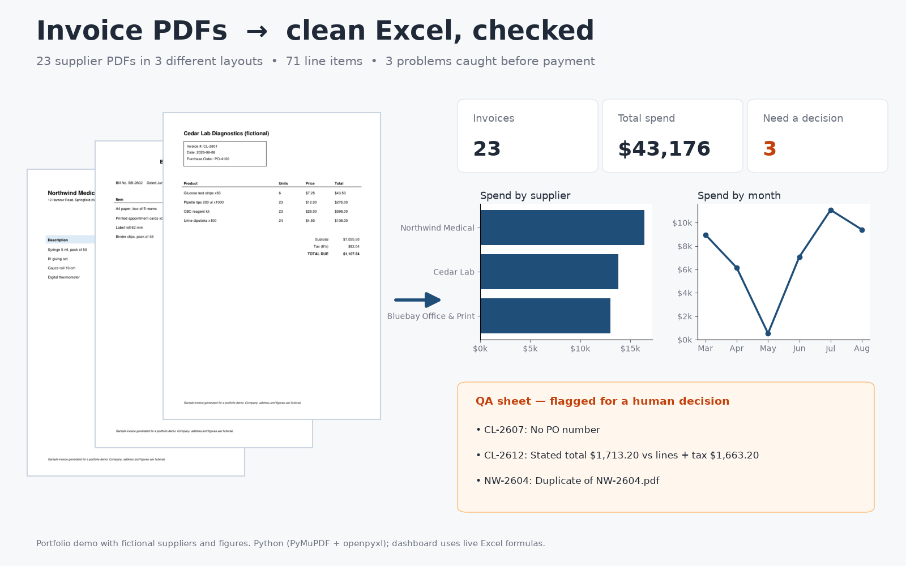

# Invoice PDFs → clean Excel, checked



**The problem:** a clinic, shop or agency receives supplier invoices as PDFs, each supplier with its own layout.
Someone retypes them into a spreadsheet, and mistakes (a resent invoice paid twice, a total that doesn't add up,
a missing PO number) slip through to payment.

**What this does:** point it at a folder of invoice PDFs and it produces one Excel workbook:

| Sheet | Contents |
|---|---|
| **Dashboard** | invoices processed, total spend, items needing a decision; spend by supplier and by month (native Excel charts on `SUMIFS` formulas, so it updates when rows change) |
| **Invoices** | one row per PDF: supplier, invoice no, date, PO, subtotal, tax, total, recomputed total, and a check column highlighted red on mismatch |
| **LineItems** | every line: invoice no, description, qty, unit price, amount |
| **QA** | what needs a human decision, and what to decide |

**Demo run (this folder):** 23 PDFs in 3 different supplier layouts → 71 line items. The QA sheet caught all 3
planted problems and raised no false alarms:

- `CL-2607`: no PO number → match to a purchase order or get approval
- `CL-2612`: stated total $1,713.20 vs lines + tax $1,663.20 → ask the supplier for a corrected invoice
- `NW-2604_resent.pdf`: duplicate of `NW-2604.pdf` → pay once

## Run it

```bash
pip install pymupdf openpyxl
python make_invoices.py            # creates the 23 sample PDFs in invoices/
python extract.py invoices invoices.xlsx
python render_cover.py             # optional: the image above (needs matplotlib, pillow)
```

## How it works

- Text and word positions come from PyMuPDF. Header fields (invoice no, date, PO) use a small set of label
  patterns per layout; line items are read by grouping words into rows and columns by position, so no template
  image matching is needed.
- Dates in three formats (`29/06/2026`, `Jun 29, 2026`, `2026-06-29`) are normalised to real Excel dates.
- Every total is re-computed from its own lines + tax. Duplicates are detected by supplier + invoice number,
  not by file name, because resent invoices usually arrive under a new name.
- For a real client, new supplier layouts are added as label patterns and tested on their own files first.
  Scanned (image-only) invoices need an OCR step before this.

*Portfolio demo: all suppliers, addresses and figures are fictional.*
